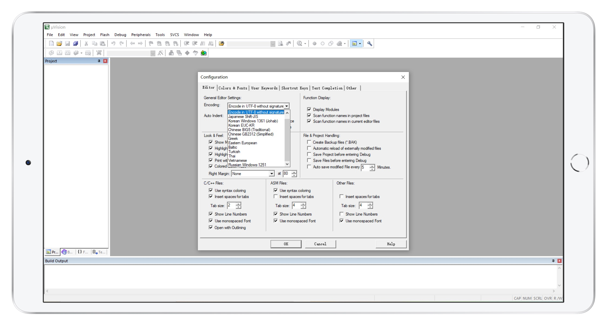

# Lib-code

嵌入式-编码转换


## 目录

- [Lib-code](#lib-code)
- [目录](#目录)
- [快速入门](#快速入门)
  - [下载](#下载)
  - [目录说明](#目录说明)
  - [Keil 设置](#keil-设置)
- [参考资料](#参考资料)
  - [UTF-8](#UTF-8)
  - [UCS2](#UCS2)
- [项目进展](#项目进展)
- [实际应用](#实际应用)
- [维护者](#维护者)
- [许可证](#许可证)

## 快速入门

### 下载

 ```git
 git clone https://github.com/ChenxuanZhao/lib-code.git
 ```

### 目录说明

 ``` bash
├─Core       // 源码
│  ├─Inc     // 头文件
│  ├─Lib     // LIB 库
│  └─Src     // 源代码
├─Demo       // 例程
└─Lib-creat  // Lib 库创建
 ```

### Keil 工程设置

> Encoding: Encode in UTF-8 without signature



## 参考资料

### UTF-8

#### 简介

UTF-8 (8位元，Universal Character Set/Unicode Transformation Format) 是针对Unicode的一种可变长度字符编码。它可以用来表示Unicode标准中的任何字符，而且其编码中的第一个字节仍与ASCII相容，使得原来处理ASCII字符的软件无须或只进行少部份修改后，便可继续使用。因此，它逐渐成为电子邮件、网页及其他存储或传送文字的应用中，优先采用的编码

#### 字符集

UTF-8编码规则：如果只有一个字节则其最高二进制位为0；如果是多字节，其第一个字节从最高位开始，连续的二进制位值为1的个数决定了其编码的字节数，其余各字节均以10开头。UTF-8转换表表示如下：

| Unicode编码 (hex) | UTF-8 字节流 (bin))                 |
|-------------------|-------------------------------------|
| 000000 - 00007F   | 0xxxxxxx                            |
| 000080 - 0007FF   | 110xxxxx 10xxxxxx                   |
| 000800 - 00FFFF   | 1110xxxx 10xxxxxx 10xxxxxx          |
| 010000 - 10FFFF   | 11110xxx 10xxxxxx 10xxxxxx 10xxxxxx |
[更多资料](https://baike.baidu.com/item/UTF-8/481798)

### UCS2

Unicode（统一码、万国码、单一码）是计算机科学领域里的一项业界标准，包括字符集、编码方案等。Unicode 是为了解决传统的字符编码方案的局限而产生的，它为每种语言中的每个字符设定了统一并且唯一的二进制编码，以满足跨语言、跨平台进行文本转换、处理的要求。1990年开始研发，1994年正式公布。

通用字符集（Universal Character Set, UCS）是由ISO制定的ISO 10646（或称ISO/IEC 10646）标准所定义的标准字符集。UCS-2用两个字节编码，UCS-4用4个字节编码。

[更多资料](https://baike.baidu.com/item/Unicode)

## 项目进展

### MCU

- [x] C51
- [x] Arm

### 单字符

- [x]  UTF-8 -> UCS2
- [x]  UCS2  -> UTF-8

### 字符串

- [x]  UTF-8 -> UCS2 编码
- [x]  UCS2 编码 -> UTF-8

## 实际应用

- [x] GSM 模块 收发中文短信

## 维护者

 [Chenxuan Zhao](https://github.com/ChenxuanZhao)

## 许可证

 [Apache License](LICENSE)  
 Copyright (c) 2020 Kiyotaka
